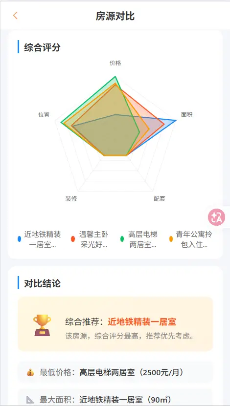

# 🏠 SweetHome - 移动端租房平台 (Vue3 + Vant4)

[](https://vuejs.org/)
[](https://vant-ui.github.io/vant/)
[](https://vitejs.dev/)
[](https://opensource.org/licenses/MIT)

**SweetHome** 是一款基于 Vue 3 + Vant UI 构建的移动端租房应用。更是为了自我提升，从0到1构建、模拟、还原的实战尝试。

---

## 📸 预览 (Screenshots)

<p align="center">
  
  
  
</p>

---

## 📖 功能特性 (Features)

- 🔍 **房源搜索**：支持多维度筛选（区域、价格、户型）与历史记录管理。
- 📊 **房源对比**：独特的“横向对比”功能，直观分析不同房源的优劣。
- 📝 **全链路 Mock**：支持登录、收藏、发布评论等操作的持久化存储。
- 💬 **消息系统**：模拟真实即时通讯界面与未读消息提醒。
- 👤 **个人中心**：集成订单管理、收藏夹、安全退出流程。

---

## ✨ 项目核心亮点

### 1. 🏗️ 规范的架构设计
- **前后端解耦**：内置完整的 **基于 LocalStorage 的持久化模拟层**，实现全功能业务闭环，无需后端环境即可开箱即用。
- **Service 层封装**：统一管理 API 请求，方便未来无缝切换真实生产接口。
- **自定义指令与 Hooks**：封装了 `v-ftime` 格式化时间指令及分页加载、状态管理等组合式逻辑。

### 2. 🧩 深度组件化拆分
- 核心页面（Detail, Compare, Profile, Home）均进行了逻辑解耦，将复杂逻辑拆分至次级 `cpns` 目录，极大地提升了代码的可读性与可维护性。

### 3. 🛡️ 全局认证与安全
- **中心化登录拦截**：封装全局 `checkLogin` 工具，支持路由守卫硬拦截与页面内操作软拦截。
- **状态联动**：实现登录后自动回跳（Redirect）及全局未读消息实时同步。

### 4. ⚡ 极致交互体验 (UX)
- **平滑 Loading**：带有毛玻璃效果（Backdrop Filter）的全局平滑加载动画。
- **防冒泡处理**：严谨的事件冒泡控制（`.stop`），确保移动端点击交互精准无误。
- **搜索优化**：完整的搜索历史记录、多维度筛选标签及房源数据横向对比。

---

## 🚀 快速开始

1. 安装依赖(推荐使用 Node.js v22+)
```bash
npm install
```

2. 运行开发环境
```bash
npm run dev
```
3. 项目打包

```bash
npm run build
# 构建完成后，可运行以下命令预览生产效果
npm run preview
```

---

## 🛠️ 技术栈

| 核心库 | 说明 |
| :--- | :--- |
| **Vue 3** | 使用 `script setup` 组合式 API 编写 |
| **Vant 4** | 移动端主流 UI 组件库 |
| **Pinia** | 模块化状态管理（User, Favorite, Message, Main） |
| **Mock.js** | **内置高保真数据模拟层**，拦截 Ajax 请求 |
| **Vue Router** | 路由管理，支持页面缓存（Keep-alive） |
| **SCSS** | 模块化样式开发 |

## 🛠️ 环境要求 (Environment)

- **Node.js**: `v22.17.0` 或更高版本 (推荐使用 LTS 版本)
- **Package Manager**: `npm` 或 `pnpm`

## ⚙️ 配置说明 (Configuration)

本项目采用环境变量控制数据流向，配置文件位于根目录的 `.env.development` 和 `.env.production`。

| 变量名 | 说明 | 默认值 |
| :--- | :--- | :--- |
| **VITE_USE_MOCK** | 是否开启 Mock 模拟数据 (true/false) | `true` |
| **VITE_BASE_URL** | 真实后端 API 地址 | `''` |

> **提示**：若需对接真实后端，请将 `VITE_USE_MOCK` 改为 `false` 并填入有效的 `VITE_BASE_URL`。本项目即便在生产环境（Build 后）依然支持 Mock 模式，非常适合作为静态 Demo 展示。

---

## 📂 目录结构预览

```text
src/
├── assets/         # 静态资源（图片、全局样式）
├── mock/           # 数据模拟层（拦截请求并返回动态数据）
├── service/        # API 请求统一入口
├── stores/         # Pinia 状态管理模块
├── hooks/          # 组合式函数封装（分页、倒计时等）
├── directives/     # 自定义指令（时间格式化等）
├── components/     # 全局公共 UI 组件
└── views/          # 业务页面（内含私有 cpns 组件）
```

---

## 🌐 部署 (Deployment)

本项目支持零成本部署至 **Vercel**、**GitHub Pages** 或 **Netlify**。
由于内置了 Mock 层，部署后即可在线预览完整业务功能。

1. 执行 `npm run build`
2. 将生成的 `dist` 目录上传至静态托管平台即可。

---

## 🙏 致谢

- [Vue.js](https://vuejs.org/) - 渐进式 JavaScript 框架
- [Vant UI](https://vant-ui.github.io/vant/) - 轻量、可靠的移动端组件库
- 感谢coderwhy老师带我入门Vue3

---

## 📄 开源协议

[MIT](./LICENSE) © 2026 SweetHome